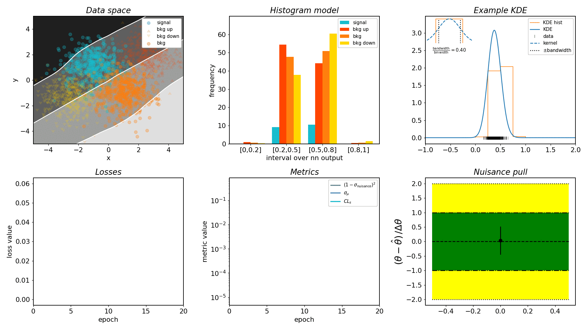

# neos
> ~neural~ nice end-to-end optimized statistics

[![Actions Status][actions-badge]][actions-link]
[![Documentation Status][rtd-badge]][rtd-link]
[![Code style: black][black-badge]][black-link]

[![PyPI version][pypi-version]][pypi-link]
[![PyPI platforms][pypi-platforms]][pypi-link]

[](https://zenodo.org/badge/latestdoi/235776682)


[actions-badge]:            https://github.com/gradhep/neos/workflows/CI/badge.svg
[actions-link]:             https://github.com/gradhep/neos/actions
[black-badge]:              https://img.shields.io/badge/code%20style-black-000000.svg
[black-link]:               https://github.com/psf/black
[conda-badge]:              https://img.shields.io/conda/vn/conda-forge/neos
[conda-link]:               https://github.com/conda-forge/neos-feedstock
[codecov-badge]:            https://app.codecov.io/gh/gradhep/neos/branch/main/graph/badge.svg
[codecov-link]:             https://app.codecov.io/gh/gradhep/neos
[github-discussions-badge]: https://img.shields.io/static/v1?label=Discussions&message=Ask&color=blue&logo=github
[github-discussions-link]:  https://github.com/gradhep/neos/discussions
[gitter-badge]:             https://badges.gitter.im/https://github.com/gradhep/neos/community.svg
[gitter-link]:              https://gitter.im/https://github.com/gradhep/neos/community?utm_source=badge&utm_medium=badge&utm_campaign=pr-badge
[pypi-link]:                https://pypi.org/project/neos/
[pypi-platforms]:           https://img.shields.io/pypi/pyversions/neos
[pypi-version]:             https://badge.fury.io/py/neos.svg
[rtd-badge]:                https://readthedocs.org/projects/neos/badge/?version=latest
[rtd-link]:                 https://neos.readthedocs.io/en/latest/?badge=latest
[sk-badge]:                 https://scikit-hep.org/assets/images/Scikit--HEP-Project-blue.svg

[](https://mybinder.org/v2/gh/gradhep/neos/main?filepath=demo.ipynb)




## About

Run the binder demo :) -> [](https://mybinder.org/v2/gh/gradhep/neos/main?filepath=demo.ipynb)

Leverages the shoulders of giants ([`jax`](https://github.com/google/jax/) and [`pyhf`](https://github.com/scikit-hep/pyhf)) to differentiate through a high-energy physics analysis workflow, including the construction of the frequentist profile likelihood.

If you're more of a video person, see [this talk](https://www.youtube.com/watch?v=3P4ZDkbleKs) given by [Nathan](https://github.com/phinate) on the broader topic of differentiable programming in high-energy physics, which also covers `neos`.

## Example usage -- train a neural network to optimize an expected p-value

### setup
In a python 3 environment, run the following:
```
pip install --upgrade pip setuptools wheel
pip install neos
pip install git+http://github.com/scikit-hep/pyhf.git@make_difffable_model_ctor
```

With this, you should be able to run the demo notebook [demo.ipynb](demo.ipynb) on your pc :)

This workflow is as follows:
- From a set of normal distributions with different means, we'll generate four blobs of `(x,y)` points, corresponding to a signal process, a nominal background process, and two variations of the background from varying the background distribution's mean up and down.
- We'll then feed these points into the previously defined neural network for each blob, and construct a histogram of the output using kernel density estimation. The difference between the two background variations is used as a systematic uncertainty on the nominal background.
- We can then leverage the magic of `pyhf` to construct an [event-counting statistical model](https://scikit-hep.org/pyhf/intro.html#histfactory) from the histogram yields.
- Finally, we calculate the p-value of a test between the nominal signal and background-only hypotheses. This uses the familiar [profile likelihood-based test statistic](https://arxiv.org/abs/1007.1727).

This counts as one forward pass of the workflow -- we then optimize the neural network by gradient descent, backpropagating through the whole analysis!


## Thanks

A big thanks to the teams behind [`jax`](https://github.com/google/jax/), [`fax`](https://github.com/gehring/fax), [`jaxopt`](http://github.com/google/jaxopt) and [`pyhf`](https://github.com/scikit-hep/pyhf) for their software and support.
